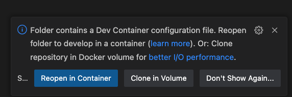
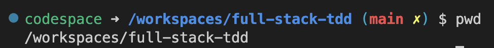

# Full-Stack TDD RPS

React SPA and Spring Boot API for full-stack TDD practice

## Pre-Requisites
- Docker
- VSCode

## About the apps
- **rpsapi**
    - Spring Boot API (Java 17)
    - see [README](./rpsapi/README.md) for details of setup
- **rps-web**
    - React SPA (TypeScript)
    - see [README](./rps-web/README.md) for details of setup
- **[devcontainer](https://containers.dev/overview)**
    - uses GitHub CodeSpaces' default image `mcr.microsoft.com/devcontainers/universal:2`
    - see [devcontainer.json](./.devcontainer/devcontainer.json) for details of setup

## Getting Started
- Clone the repo
- Start docker
- Open the project with VSCode

  - 
  - when the above popup appears, select `Reopen in Container`. (`Clone in Volume` will also work)
  - VSCode will build the development container. Once running, the terminal prompt should look like this.
  - 
  - You're now ready to develop in the container!
  
- Start the web app
  - `cd rps-web`
  - `npm install`
  - `npm start`
  - the app will run on `http://localhost:3000`. The devcontainer has mapped port 3000:3000
- Start the API
  - `cd rpsapi`
  - `./gradlew bootRun`
  - the app will run on `http://localhost:8080`. The devcontainer has mapped port 8080:8080

